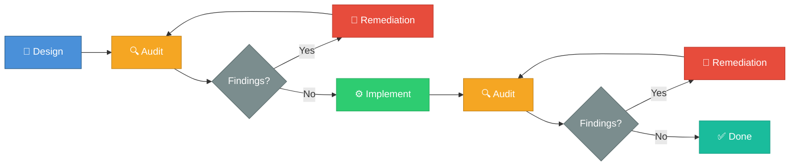

<div align="center">

# Karsa Skill

### An AI Engineering Workflow Framework

[](LICENSE)
[](https://github.com/skeithnight/karsa-skill/releases)

*Design before implementation. Audit everything. Remediate before proceeding.*

</div>

---

## Overview

**Karsa Skill** is an engineering workflow framework that brings rigorous, auditable processes to AI-assisted software development. Built for the Gemini CLI ecosystem, it provides a structured collection of composable skills that enforce production-grade quality at every stage of the development lifecycle — from initial design through final release.

With the latest major refactor, Karsa Skill operates as a **complete execution orchestration layer**. Each skill encodes not just *what* to do, but *how* to do it correctly via automated shell scripts, *when* to validate results, and *what evidence* to produce for auditability. The new `karsa-orchestrator` acts as an executable engine capable of driving a clean machine to a verified running Karsa environment automatically.

The framework is built on the principle that AI-assisted development should be **more disciplined**, not less. Every skill produces verifiable JSON evidence, every workflow includes mandatory quality gates, and every execution step supports failure resumption. This creates a development process that is reproducible, auditable, and continuously improvable.

Karsa Skill is designed for engineers and teams who demand the same rigor from their AI-assisted workflows as they do from their traditional development processes. Whether you are a solo developer validating your own work or a team lead ensuring consistency across contributors, Karsa Skill provides the scaffolding to make quality non-negotiable.

---

## Why Karsa Skill?

| Value Proposition | Description |
|---|---|
| **Auditable Workflows** | Every skill produces structured artifacts with clear evidence trails. Decisions, findings, and actions are recorded in standardized formats that support retrospective analysis and compliance requirements. |
| **Composable Skills** | Skills are modular building blocks that can be combined into complex workflows. Each skill has well-defined inputs, outputs, and contracts, enabling flexible orchestration without sacrificing consistency. |
| **Production-Grade Quality Gates** | Mandatory audit and remediation phases are embedded directly into the workflow. Code does not advance until quality criteria are met, preventing technical debt from accumulating silently. |
| **Persona-Driven Entry Points** | Skills are organized into categories that map to engineering roles and responsibilities — from architecture review to test engineering to release management — ensuring the right process is applied at the right time. |

---

## Architecture-First Development

Karsa Skill is built on a core philosophy: **design before implementation, audit everything, remediate before proceeding.**

Traditional AI-assisted development often follows a generate-and-fix pattern — produce code quickly, then spend cycles debugging and refactoring. Karsa Skill inverts this model. By front-loading design and architectural review, the framework ensures that implementation begins only after the approach has been validated. By mandating post-implementation audits, it ensures that quality is verified, not assumed.

This approach yields compounding benefits:

- **Fewer defects** reach production because issues are caught during design review, not in production monitoring.
- **Lower rework costs** because architectural misalignments are identified before code is written.
- **Stronger audit trails** because every phase produces documented evidence of decisions and their rationale.
- **Faster onboarding** because new contributors can follow established, documented workflows rather than tribal knowledge.

The framework treats quality as a **structural property** of the workflow itself, not as an afterthought applied via linting or code review.

---

## Workflow

Karsa Skill enforces a disciplined lifecycle for every significant engineering task:



**Phase Descriptions:**

| Phase | Purpose |
|---|---|
| **Design** | Produce architectural decisions, interface contracts, and implementation plans before writing code. |
| **Audit (Pre-Implementation)** | Review the design for correctness, completeness, security implications, and alignment with project goals. |
| **Remediation** | Address all findings from the audit. No finding is ignored — each must be resolved or explicitly accepted with rationale. |
| **Implement** | Execute the approved design with full awareness of constraints and decisions documented in prior phases. |
| **Audit (Post-Implementation)** | Verify the implementation against the design, quality standards, and acceptance criteria. |
| **Remediation** | Resolve any post-implementation findings before the work is considered complete. |

---

## Operational Execution Engine

Karsa's `karsa-orchestrator` and `karsa-local-production` skills provide true execution capabilities. You can deploy an entire project automatically:

```bash
./skills/karsa-local-production/scripts/execute.sh <repo_url> <target_dir>
```

This triggers the orchestration sequence:
1. **Clone**: Authenticates and retrieves the specified project repository.
2. **Audit**: Code scanning and pre-flight checks.
3. **Install**: Determines the package manager and installs dependencies.
4. **Configure**: Discovers `.env.example` and automatically provisions `.env`.
5. **Research**: Queries authoritative documentation to resolve any missing prerequisites.
6. **Build**: Executes the build sequence.
7. **Test**: Executes test suites.
8. **Runtime Verify**: Spawns the process and evaluates health checks.
9. **Browser Verify**: Programmatically hits major application routes.
10. **Production Audit**: Final sign-off.
11. **Final Verdict**: Outputs the complete workflow state and evidence list.

Each phase generates precise JSON evidence (e.g., `clone-evidence.json`, `build-evidence.json`) and the orchestrator allows for seamless failure resumption by tracking state in `.karsa/workflow-state.json`.

---

## Skill Catalog

Karsa Skill ships with **16 composable skills** organized across five categories:

### Core Workflow Skills

| Skill | Description |
|---|---|
| `feature-bootstrap` | Initializes feature development with discovery, planning, and readiness contracts. Ensures all prerequisites are met before implementation begins. |
| `brainstorm-to-feature` | Transforms informal ideas and brainstorms into production-ready code with tests, documentation, and quality compliance. |
| `workflow-manager` | Orchestrates workspace state transitions, verifies gate conditions, and executes precondition rulesets across the development lifecycle. |
| `scope-change` | Manages feature scope updates after approval, ensuring traceability and preventing uncontrolled scope creep. |

### Quality & Compliance Skills

| Skill | Description |
|---|---|
| `quality-review` | Conducts automated code analysis, convention checking, and security vulnerability validation against reference guides. |
| `sonarqube-fixer` | Fetches, analyzes, and fixes SonarQube/SonarCloud code quality issues using the SonarQube MCP integration. |
| `test-engineering` | Scaffolds test classes, runs execution checks, evaluates coverage vectors, and generates testing verification reports. |

### Documentation Skills

| Skill | Description |
|---|---|
| `create-readme` | Generates comprehensive, well-structured README files that follow open-source best practices. |
| `generate-change-summary` | Produces permanent, evidence-based change logs for completed work with full traceability. |

### Governance Skills

| Skill | Description |
|---|---|
| `architecture-review` | Conducts structured architecture reviews using standardized templates with formal approval workflows. |
| `design-review` | Evaluates design documents for completeness, correctness, and alignment with architectural standards. |
| `security-audit` | Performs security-focused audits covering OWASP categories, dependency vulnerabilities, and configuration risks. |
| `compliance-check` | Validates adherence to organizational standards, coding conventions, and regulatory requirements. |

### Delivery Skills

| Skill | Description |
|---|---|
| `sprint-closeout` | Manages sprint completion with goal verification, metric collection, retrospectives, and carryover planning. |
| `release-readiness` | Validates release gate criteria, generates release notes, and produces go/no-go recommendations. |
| `incident-postmortem` | Structures post-incident analysis with timeline reconstruction, root cause identification, and action item tracking. |

---

## Repository Structure

```
karsa-skill/
├── LICENSE
├── README.md
├── CONTRIBUTING.md
├── GOVERNANCE.md
├── ROADMAP.md
│
├── skills/                          # Composable skill definitions
│   ├── core/
│   │   ├── feature-bootstrap/
│   │   ├── brainstorm-to-feature/
│   │   ├── workflow-manager/
│   │   └── scope-change/
│   ├── quality/
│   │   ├── quality-review/
│   │   ├── sonarqube-fixer/
│   │   └── test-engineering/
│   ├── documentation/
│   │   ├── create-readme/
│   │   └── generate-change-summary/
│   ├── governance/
│   │   ├── architecture-review/
│   │   ├── design-review/
│   │   ├── security-audit/
│   │   └── compliance-check/
│   └── delivery/
│       ├── sprint-closeout/
│       ├── release-readiness/
│       └── incident-postmortem/
│
├── templates/                       # Standardized document templates
│   ├── architecture/
│   │   └── ARCHITECTURE_REVIEW_TEMPLATE.md
│   ├── audit/
│   │   └── AUDIT_REPORT_TEMPLATE.md
│   ├── remediation/
│   │   └── REMEDIATION_REPORT_TEMPLATE.md
│   ├── sprint/
│   │   └── SPRINT_CLOSEOUT_TEMPLATE.md
│   └── release/
│       └── RELEASE_READINESS_TEMPLATE.md
│
├── examples/                        # Usage examples and sample workflows
│   ├── basic-feature-workflow/
│   ├── full-audit-cycle/
│   └── release-process/
│
└── docs/                            # Extended documentation
    ├── architecture.md
    ├── skill-development-guide.md
    └── workflow-reference.md
```

---

## Installation

### Clone the Repository

```bash
git clone git@github.com-personal:skeithnight/karsa-skill.git
```

### Configure with Gemini CLI

Karsa Skill is designed to work as a skills directory for the Gemini CLI. To integrate:

1. **Copy skills to your Gemini configuration:**

   ```bash
   cp -r karsa-skill/skills/* ~/.gemini/config/skills/
   ```

2. **Or symlink for easier updates:**

   ```bash
   ln -sf $(pwd)/karsa-skill/skills/* ~/.gemini/config/skills/
   ```

3. **Verify installation** by checking that skills appear in your Gemini CLI session's available skills list.

### Requirements

- Gemini CLI with skill support enabled
- Git 2.30+ for repository management

---

## Usage

### Invoking a Skill

Skills are invoked through natural language in your Gemini CLI session. Once installed, reference skills by their trigger phrases:

**Bootstrap a new feature:**
```
"Bootstrap the user authentication feature — discover requirements and create the implementation plan."
```

**Run a quality review:**
```
"Run a quality review on the payment processing module."
```

**Generate a change summary:**
```
"Generate a change summary for the work completed on the API refactoring."
```

### Using Templates

Templates are available in the `templates/` directory for manual use or for skills that auto-populate them during workflow execution:

```bash
# Copy a template for use
cp templates/audit/AUDIT_REPORT_TEMPLATE.md docs/audits/2026-06-16-auth-module-audit.md
```

### Composing Workflows

Skills can be chained together for complete workflows:

```
1. "Bootstrap the search feature"           → feature-bootstrap
2. "Review the architecture"                → architecture-review
3. "Develop this feature"                   → brainstorm-to-feature
4. "Run a quality review"                   → quality-review
5. "Fix the sonar issues"                   → sonarqube-fixer
6. "Generate a change summary"             → generate-change-summary
```

---

## Examples

The [`examples/`](examples/) directory contains complete, runnable workflow examples:

- **`basic-feature-workflow/`** — End-to-end feature development from bootstrap through implementation and quality review.
- **`full-audit-cycle/`** — Complete audit and remediation cycle demonstrating the design-audit-remediate loop.
- **`release-process/`** — Release readiness workflow including sprint closeout and release gate validation.

Each example includes annotated transcripts showing skill invocations, intermediate artifacts, and final outputs.

---

## Governance

Karsa Skill follows a structured governance model that ensures framework quality and evolution are managed systematically. Key aspects include:

- **Skill Acceptance Criteria** — All new skills must meet documentation, testing, and quality standards before inclusion.
- **Change Management** — Framework changes follow the same design-audit-remediate workflow that the framework prescribes.
- **Version Policy** — Semantic versioning with clear compatibility guarantees.

For the complete governance framework, see [`GOVERNANCE.md`](GOVERNANCE.md).

---

## Roadmap

The Karsa Skill roadmap is organized into quarterly milestones focused on expanding skill coverage, improving composability, and enhancing integration capabilities:

- **Q3 2026** — Core skill stabilization and template refinement.
- **Q4 2026** — Advanced workflow orchestration and cross-skill dependency management.
- **Q1 2027** — Community contribution framework and plugin architecture.

For the detailed roadmap with milestone definitions, see [`ROADMAP.md`](ROADMAP.md).

---

## Contributing

Contributions to Karsa Skill are welcome. The contribution process follows the same audit-driven workflow that the framework itself prescribes:

1. **Propose** — Open an issue describing the skill or improvement.
2. **Design** — Submit a design document for review.
3. **Implement** — Build the skill following the skill development guide.
4. **Audit** — Pass the quality review process.
5. **Merge** — Upon approval, changes are merged into main.

For detailed contribution guidelines, see [`CONTRIBUTING.md`](CONTRIBUTING.md).

---

## License

Karsa Skill is released under the [MIT License](LICENSE).

```
Copyright (c) 2026 skeithnight
```

---

<div align="center">

*Built with discipline. Shipped with confidence.*

</div>
