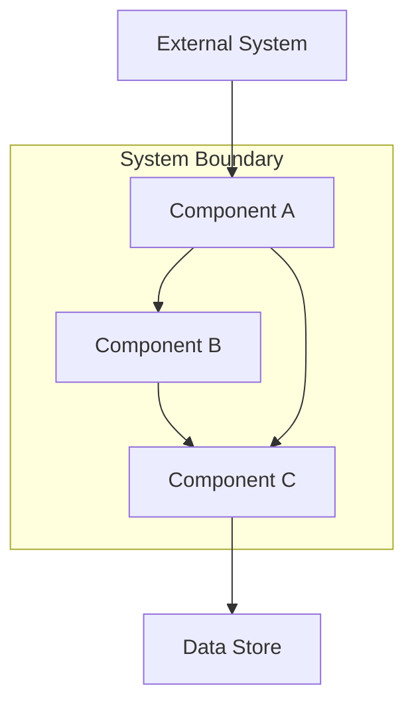

# Architecture Review Report

> This document captures the results of a formal architecture review conducted as part of the Karsa Skill engineering workflow. It provides structured assessment of architectural quality, risk identification, and actionable recommendations.

---

## How to Use This Template

1. **Copy this template** to your project's documentation directory and rename it with the review date and scope (e.g., `2026-06-16-payment-service-architecture-review.md`).
2. **Fill in the Review Metadata** section with the details of the review engagement.
3. **Document the Architecture Overview** by describing the current or proposed architecture under review. Include diagrams where appropriate.
4. **Complete the Component Analysis** table by evaluating each significant component against the provided criteria.
5. **Assess each Quality Attribute** using the structured guidance provided. Rate each attribute and provide evidence-based justification.
6. **Identify risks** in the Risk Assessment section, rating likelihood and impact for each.
7. **Record all findings** in the Findings table with severity ratings and actionable recommendations.
8. **Render a final decision** based on the totality of findings. If findings exist, they must be addressed through a formal remediation cycle before the architecture is considered approved.

> [!IMPORTANT]
> All fields marked with `[PLACEHOLDER]` must be replaced with actual content. Do not leave any placeholders in the completed review.

---

## Review Metadata

| Field | Value |
|---|---|
| **Project** | [Project or service name] |
| **Review Date** | [YYYY-MM-DD] |
| **Reviewer(s)** | [Names and roles of reviewers] |
| **Review Scope** | [Specific components, services, or subsystems under review] |
| **Architecture Version** | [Version identifier or commit hash of the architecture being reviewed] |
| **Review Type** | [Initial / Incremental / Pre-Release / Post-Incident] |
| **Related Documents** | [Links to design docs, ADRs, or prior review reports] |

---

## Architecture Overview

### System Context

Provide a high-level description of the system's purpose, its primary users, and its position within the broader ecosystem. Include a system context diagram if available.

```
[Describe the system context here. Include:
- What the system does and why it exists
- Who the primary users and consumers are
- What external systems it integrates with
- What the key data flows are]
```

### Architecture Diagram

Include or reference the primary architecture diagram. Use Mermaid, C4, or any standardized notation.



> Replace the diagram above with the actual architecture diagram for the system under review.

### Key Design Decisions

List the significant architectural decisions that have been made. Reference Architecture Decision Records (ADRs) where they exist.

| Decision | Rationale | Alternatives Considered | ADR Reference |
|---|---|---|---|
| [Decision description] | [Why this approach was chosen] | [What other options were evaluated] | [Link to ADR if available] |

---

## Component Analysis

Evaluate each significant component or service in the architecture against the following criteria:

- **Coupling**: How dependent is this component on other components? (Low / Medium / High)
- **Cohesion**: How well-focused is this component's responsibility? (Low / Medium / High)
- **Assessment**: Overall architectural health of this component. (Healthy / Acceptable / Concerning / Critical)

| Component | Responsibility | Coupling | Cohesion | Assessment | Notes |
|---|---|---|---|---|---|
| [Component name] | [Primary responsibility] | [Low/Med/High] | [Low/Med/High] | [Healthy/Acceptable/Concerning/Critical] | [Additional observations] |
| [Component name] | [Primary responsibility] | [Low/Med/High] | [Low/Med/High] | [Healthy/Acceptable/Concerning/Critical] | [Additional observations] |
| [Component name] | [Primary responsibility] | [Low/Med/High] | [Low/Med/High] | [Healthy/Acceptable/Concerning/Critical] | [Additional observations] |

### Component Interaction Patterns

Describe how components communicate with each other. Identify patterns such as synchronous/asynchronous messaging, event-driven communication, shared databases, or API contracts.

```
[Document the primary interaction patterns:
- Communication protocols (REST, gRPC, message queues, etc.)
- Data sharing mechanisms
- Error propagation strategies
- Circuit breaker or retry policies]
```

---

## Quality Attributes

Assess each quality attribute against the architectural design. For each attribute, provide a rating and evidence-based justification.

**Rating Scale:** Excellent | Good | Adequate | Inadequate | Not Assessed

### Scalability

| Aspect | Rating | Evidence |
|---|---|---|
| **Horizontal Scalability** | [Rating] | [Can the system scale out by adding instances? What are the constraints?] |
| **Vertical Scalability** | [Rating] | [Can individual components handle increased load through resource allocation?] |
| **Data Scalability** | [Rating] | [How does the data layer handle growth? Partitioning, sharding, archival strategies?] |
| **Elasticity** | [Rating] | [Can the system scale dynamically in response to demand?] |

**Scalability Assessment Summary:**
```
[Provide an overall scalability assessment. Identify bottlenecks, single points of contention, and growth limitations.]
```

### Performance

| Aspect | Rating | Evidence |
|---|---|---|
| **Latency** | [Rating] | [Expected response times for critical paths. Are SLOs defined?] |
| **Throughput** | [Rating] | [Expected transaction volumes. Are capacity limits understood?] |
| **Resource Efficiency** | [Rating] | [CPU, memory, network utilization patterns. Any wasteful allocations?] |
| **Caching Strategy** | [Rating] | [Is caching used appropriately? Cache invalidation strategy?] |

**Performance Assessment Summary:**
```
[Provide an overall performance assessment. Identify hot paths, potential bottlenecks, and optimization opportunities.]
```

### Security

| Aspect | Rating | Evidence |
|---|---|---|
| **Authentication** | [Rating] | [How are users and services authenticated? What protocols are used?] |
| **Authorization** | [Rating] | [How is access control enforced? RBAC, ABAC, or other models?] |
| **Data Protection** | [Rating] | [Encryption at rest and in transit. Key management practices.] |
| **Attack Surface** | [Rating] | [Exposed endpoints, input validation, dependency vulnerabilities.] |
| **Audit Logging** | [Rating] | [Are security-relevant events logged? Log integrity protections?] |

**Security Assessment Summary:**
```
[Provide an overall security assessment. Identify vulnerabilities, compliance gaps, and areas requiring hardening.]
```

### Maintainability

| Aspect | Rating | Evidence |
|---|---|---|
| **Code Organization** | [Rating] | [Is the codebase well-structured? Clear module boundaries?] |
| **Documentation** | [Rating] | [Is the architecture documented? Are APIs specified?] |
| **Testability** | [Rating] | [Can components be tested in isolation? Test infrastructure quality?] |
| **Dependency Management** | [Rating] | [Are dependencies well-managed? Version pinning, update policies?] |
| **Observability** | [Rating] | [Logging, metrics, tracing capabilities. Can issues be diagnosed?] |

**Maintainability Assessment Summary:**
```
[Provide an overall maintainability assessment. Identify areas of technical debt, documentation gaps, and improvement opportunities.]
```

### Reliability

| Aspect | Rating | Evidence |
|---|---|---|
| **Fault Tolerance** | [Rating] | [How does the system handle component failures? Graceful degradation?] |
| **Data Durability** | [Rating] | [Backup strategies, replication, data loss prevention.] |
| **Recovery** | [Rating] | [RTO and RPO targets. Disaster recovery procedures documented?] |
| **Monitoring & Alerting** | [Rating] | [Are health checks in place? Alerting thresholds defined?] |

**Reliability Assessment Summary:**
```
[Provide an overall reliability assessment. Identify single points of failure, recovery gaps, and resilience improvements needed.]
```

---

## Risk Assessment

Identify architectural risks that could impact the system's ability to meet its quality requirements.

**Likelihood Scale:** Very Low | Low | Medium | High | Very High
**Impact Scale:** Negligible | Low | Medium | High | Critical

| Risk ID | Risk Description | Likelihood | Impact | Risk Level | Mitigation Strategy |
|---|---|---|---|---|---|
| R-001 | [Description of the architectural risk] | [Likelihood] | [Impact] | [Computed: Likelihood × Impact] | [Proposed mitigation approach] |
| R-002 | [Description of the architectural risk] | [Likelihood] | [Impact] | [Computed: Likelihood × Impact] | [Proposed mitigation approach] |
| R-003 | [Description of the architectural risk] | [Likelihood] | [Impact] | [Computed: Likelihood × Impact] | [Proposed mitigation approach] |

### Risk Heat Map

```
Impact →    Negligible   Low        Medium     High       Critical
Likelihood
Very High                                                  
High                                                       
Medium                                                     
Low                                                        
Very Low                                                   

[Place Risk IDs in the appropriate cells of the heat map above]
```

---

## Findings

Document all findings from the architecture review. Each finding must have a clear severity, description, and actionable recommendation.

**Severity Scale:**
- **Critical** — Architectural flaw that will cause system failure or data loss. Must be resolved before proceeding.
- **High** — Significant issue that will degrade system quality or create substantial risk. Should be resolved before implementation.
- **Medium** — Moderate issue that affects quality but does not block progress. Should be resolved in the current development cycle.
- **Low** — Minor issue or improvement opportunity. Can be deferred but should be tracked.
- **Informational** — Observation or suggestion for consideration. No action required.

| Finding ID | Severity | Category | Finding | Recommendation |
|---|---|---|---|---|
| F-001 | [Critical/High/Medium/Low/Info] | [Scalability/Performance/Security/Maintainability/Reliability/Design] | [Clear description of the finding] | [Specific, actionable recommendation] |
| F-002 | [Critical/High/Medium/Low/Info] | [Category] | [Clear description of the finding] | [Specific, actionable recommendation] |
| F-003 | [Critical/High/Medium/Low/Info] | [Category] | [Clear description of the finding] | [Specific, actionable recommendation] |

### Finding Details

For each finding above, provide expanded context, evidence, and detailed recommendations.

#### F-001: [Finding Title]

**Category:** [Category]
**Severity:** [Severity]

**Description:**
```
[Detailed description of the finding. Include specific evidence from the architecture review, 
references to components or designs that exhibit the issue, and the potential consequences 
if the finding is not addressed.]
```

**Recommendation:**
```
[Detailed recommendation for resolving the finding. Include specific technical approaches,
design alternatives, or implementation strategies. Reference industry best practices or
standards where applicable.]
```

**Affected Components:** [List of components or services affected]

---

## Recommendations

Provide prioritized recommendations based on the findings above. Group recommendations by urgency.

### Immediate (Must Address Before Implementation)

1. [Recommendation linked to critical/high findings]
2. [Recommendation linked to critical/high findings]

### Short-Term (Address During Current Development Cycle)

1. [Recommendation linked to medium findings]
2. [Recommendation linked to medium findings]

### Long-Term (Track for Future Improvement)

1. [Recommendation linked to low/informational findings]
2. [Recommendation linked to low/informational findings]

---

## Decision

Based on the findings and overall assessment, the following decision is rendered:

### Verdict

> **[APPROVED / APPROVED_WITH_FINDINGS / REJECTED]**

**Verdict Definitions:**

| Verdict | Meaning |
|---|---|
| **APPROVED** | The architecture meets all quality requirements. No blocking findings exist. Implementation may proceed. |
| **APPROVED_WITH_FINDINGS** | The architecture is fundamentally sound but has findings that must be addressed. Implementation may proceed in parallel with remediation, but findings must be resolved before release. |
| **REJECTED** | The architecture has critical flaws that must be resolved before implementation can begin. A remediation cycle and re-review are required. |

### Conditions

```
[If APPROVED_WITH_FINDINGS or REJECTED, list the specific conditions that must be met:
- Which findings must be resolved
- What evidence of resolution is required
- Timeline for remediation
- Whether a re-review is required]
```

### Sign-Off

| Reviewer | Role | Decision | Date |
|---|---|---|---|
| [Name] | [Role] | [APPROVED/APPROVED_WITH_FINDINGS/REJECTED] | [YYYY-MM-DD] |

---

*This review was conducted following the Karsa Skill Architecture Review framework. All findings and recommendations are based on the architecture as documented at the time of review.*
